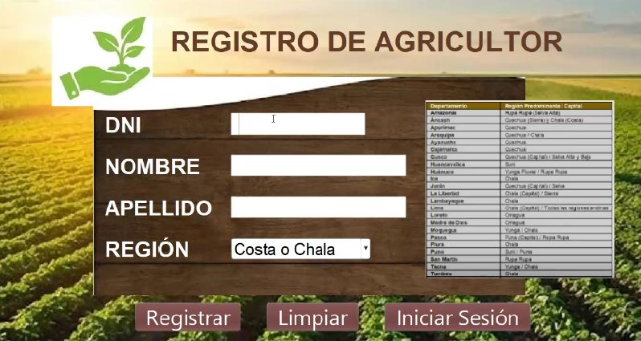
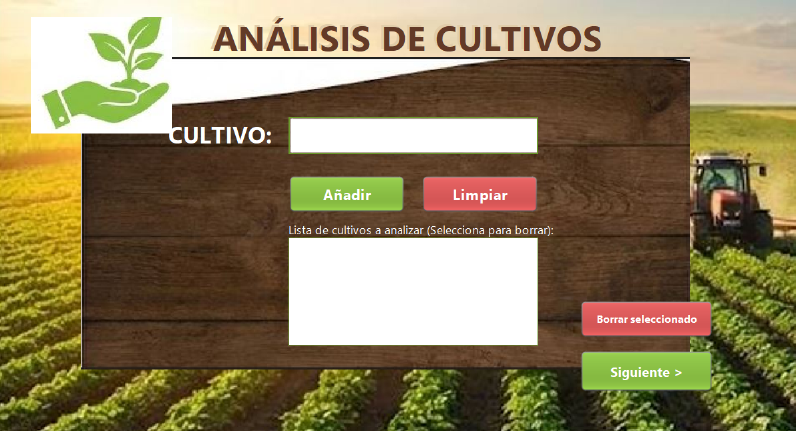
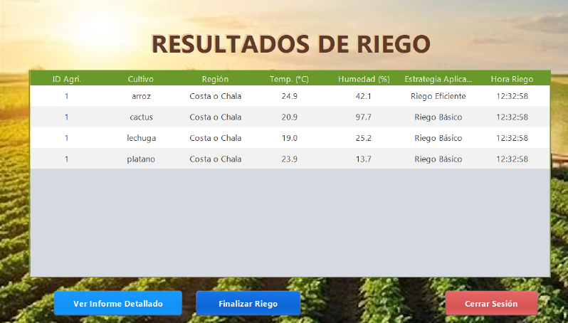

# Sistema de Gestión de Riego Automatizado

> **Curso:** Programación Orientada a Objetos - UNMSM  
> **Facultad:** Ingeniería de Sistemas e Informática

Este proyecto propone una solución tecnológica para optimizar el uso del agua en la agricultura peruana. El sistema utiliza **sensores simulados** y **patrones de diseño** para decidir automáticamente la mejor estrategia de riego (Básico, Eficiente o Especializado) según el tipo de cultivo y las condiciones climáticas (humedad y temperatura) en tiempo real.

## Documentación Completa
¿Quieres ver el detalle técnico, diagramas UML y lógica completa?
👉 **[Descarga el Informe Técnico del Proyecto aquí](./Grupo%202%20-%20Sistema%20de%20Riego%20Automatizado%20-%20Programación%20De%20Computadoras%20II.pdf)**

---

## Equipo de Desarrollo
Proyecto desarrollado por estudiantes de la UNMSM (2025):

| Integrante | Rol / Especialidad |
|:---:|:---|
| **Angel Eduardo Daniel Salazar Ruiz** (@angelslzrr) | Desarrollo Backend & Lógica |
| **Italo Josué Hurtado Flores** | Arquitectura de Software |
| **Alejandro Sachahuaman Jaramillo** (@alexito1928)| Interfaces Gráficas (Swing) |
| **Miguel Angel Villegas Torres** (@MAngelVillegasTorres)| Base de Datos (MySQL) |

---

## Tecnologías y Arquitectura

El sistema fue construido bajo una arquitectura modular robusta:

* **Lenguaje:** Java (JDK 21)
* **Base de Datos:** MySQL (Conector JDBC)
* **Patrones de Diseño:** Strategy (para las estrategias de riego), DAO (para acceso a datos), Singleton.
* **Interfaz:** Java Swing & AWT.

### Módulos del Sistema
1.  **`controlRiegoAutomatizado`:** El "cerebro" del sistema. Contiene la lógica de negocio y el generador de estrategias.
2.  **`controlSensores`:** Simulación de hardware (sensores de temperatura y humedad) adaptados a las 8 regiones del Perú.
3.  **`baseDeDatos`:** Gestión de persistencia de usuarios e historial de riegos.
4.  **`interfacesGraficas`:** Flujo visual para el agricultor.

---

## Galería del Sistema

### 1. Registro y Acceso
Permite el registro de agricultores validando DNI único por región.

### 2. Gestión de Cultivos
Panel para añadir múltiples cultivos y ejecutar el análisis en tiempo real.

### 3. Reporte de Resultados
Tabla detallada con las decisiones tomadas por el algoritmo inteligente.

---
Made by Systems Engineering Students at UNMSM.
